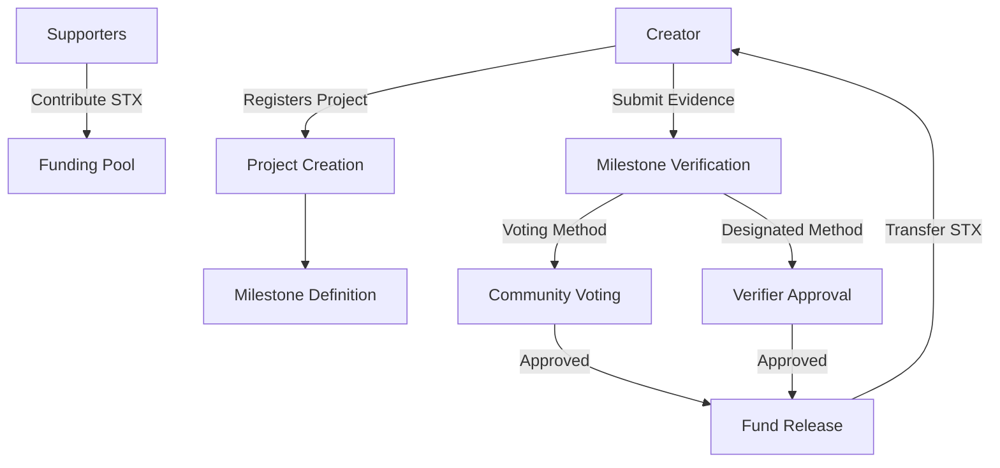

# Creator Milestone Funding

A blockchain-based platform enabling milestone-based funding for creative projects with built-in accountability and verification mechanisms.

## Overview

CreatorTide is a decentralized funding platform that creates a trustless environment for creators and supporters. It allows:

- Creators to establish projects with defined milestones and funding targets
- Supporters to contribute STX to projects they want to back
- Funds to be held in escrow until milestone completion
- Verification through either community voting or designated verifiers
- Automatic fund distribution upon milestone verification

## Architecture

The platform is built on a single smart contract that manages the entire funding lifecycle.



## Contract Documentation

### Core Components

1. **Project Management**
   - Project registration with multiple milestones
   - Funding goal tracking
   - Project status management (Active/Completed/Cancelled)

2. **Milestone System**
   - Milestone creation and tracking
   - Evidence submission
   - Verification process management

3. **Verification Methods**
   - Community voting
   - Designated verifier approval

4. **Fund Management**
   - Contribution handling
   - Escrow management
   - Automatic fund distribution
   - Refund mechanism for cancelled projects

## Getting Started

### Prerequisites

- Clarinet
- Stacks wallet
- STX tokens for interactions

### Basic Usage

1. **Creating a Project**
```clarity
(contract-call? .creator-funding register-project
    "Project Title"
    "Project Description"
    u1  ;; Verification method (1 for voting, 2 for designated)
    (list "Milestone 1" "Milestone 2")
    (list "Description 1" "Description 2")
    (list u1000 u2000))
```

2. **Contributing to a Project**
```clarity
(contract-call? .creator-funding contribute-to-project
    u1  ;; Project ID
    u100)  ;; Amount in STX
```

3. **Submitting Milestone Evidence**
```clarity
(contract-call? .creator-funding submit-milestone-evidence
    u1  ;; Project ID
    u0  ;; Milestone ID
    "Evidence URL or Description")
```

## Function Reference

### Project Management

```clarity
(register-project (title (string-ascii 100))
                 (description (string-utf8 1000))
                 (verification-method uint)
                 (milestone-titles (list 20 (string-ascii 100)))
                 (milestone-descriptions (list 20 (string-utf8 500)))
                 (milestone-amounts (list 20 uint)))
```

### Funding Operations

```clarity
(contribute-to-project (project-id uint) (amount uint))
(withdraw-contribution (project-id uint))
```

### Milestone Verification

```clarity
(submit-milestone-evidence (project-id uint)
                         (milestone-id uint)
                         (evidence (string-utf8 500)))
(vote-on-milestone (project-id uint)
                  (milestone-id uint)
                  (approve bool))
(verify-milestone (project-id uint)
                 (milestone-id uint)
                 (approved bool))
```

## Development

### Testing

1. Clone the repository
2. Install Clarinet
3. Run tests:
```bash
clarinet test
```

### Local Development

1. Start Clarinet console:
```bash
clarinet console
```

2. Deploy contract:
```bash
clarinet deploy
```

## Security Considerations

### Key Security Features

- Escrow-based fund management
- Deadline-based verification windows
- Access control for critical functions
- Automatic fund distribution
- Refund mechanisms for cancelled projects

### Limitations

- Voting system requires active community participation
- Designated verifiers must be trusted parties
- No dispute resolution mechanism for rejected milestones
- Limited to STX token contributions

### Best Practices

1. Always verify project creator's identity
2. Review milestone requirements carefully before contributing
3. Use designated verifiers only from trusted sources
4. Monitor verification deadlines for voting-based projects
5. Keep evidence submissions detailed and verifiable